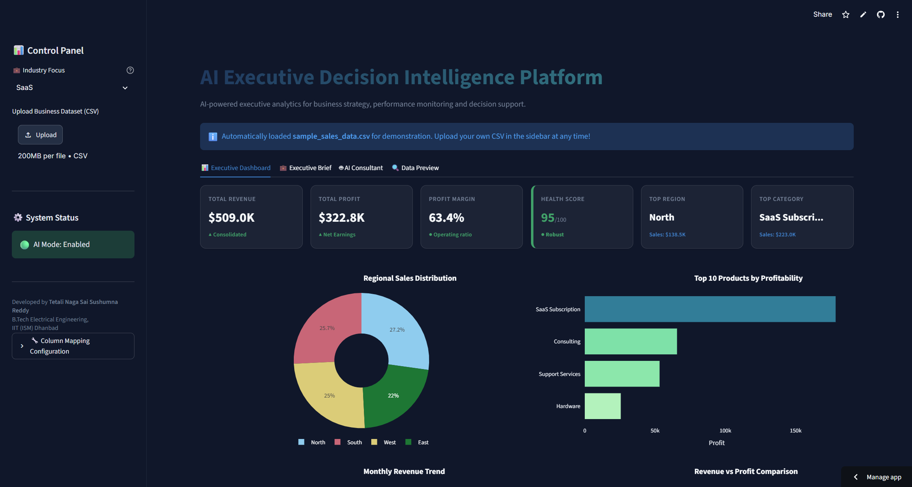
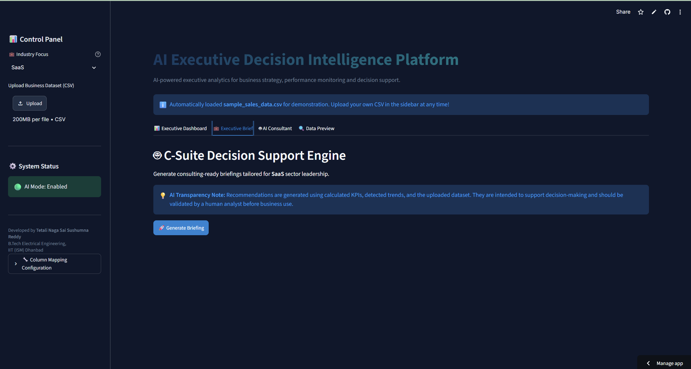
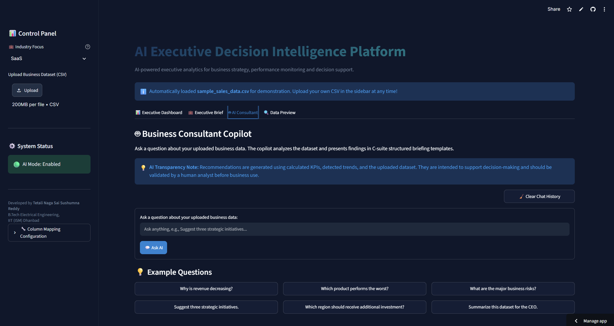
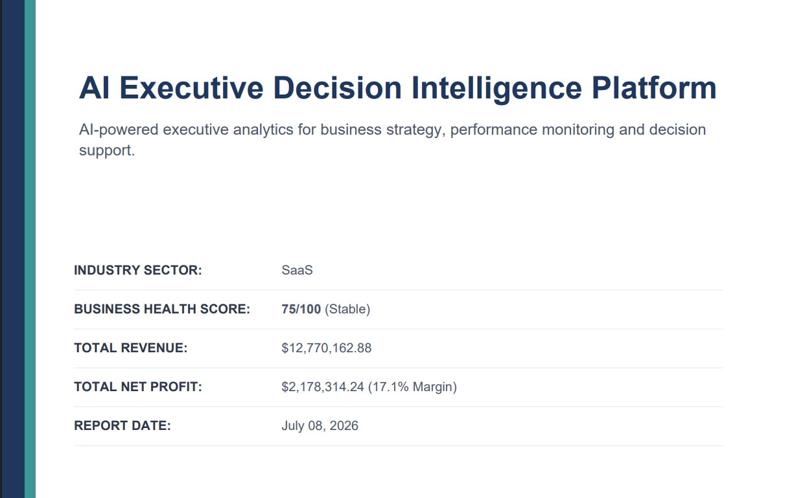
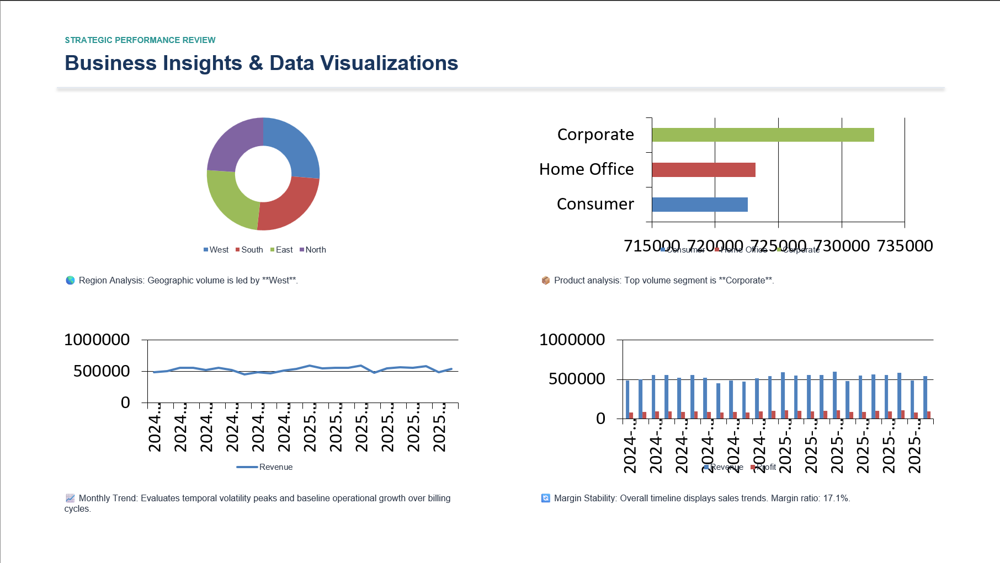

# AI Executive Decision Intelligence Platform

An AI-powered business decision support platform that turns structured datasets into executive-ready insights, strategic recommendations, and boardroom presentations.

[](https://www.python.org/)
[](https://streamlit.io/)
[](https://openai.com/)
[](https://opensource.org/licenses/MIT)

---

## 📌 Why I Built This

While working on analytics dashboards, I noticed that dashboards usually show *what* happened but rarely explain *why* it happened or what action should be taken next. Analysts often spend hours extracting numbers from charts, writing summaries, and building PowerPoint presentations for weekly or monthly business reviews. 

I built this platform to explore how Large Language Models can support business analysts by automating parts of this workflow: sanitizing datasets, computing key metrics, generating text-based executive briefs, answering contextual business questions, and outputting formatted board presentations.

---

## 🎯 Key Features

* **📂 CSV Ingestion & Mapping:** Upload raw sales or payment files with automatic column header detection.
* **📊 Interactive Dashboard:** Renders key performance indicators alongside Plotly charts (regions, products, line trends, and margins).
* **❤️ Business Health Score:** A heuristic index (0–100) aggregating revenue growth, sales consistency, and market concentration risk.
* **🤖 AI Executive Brief:** Auto-generates structured briefs covering summary, findings, risks, and recommended actions.
* **💬 AI Consultant (Strategy Copilot):** Conversational Q&A chat grounded strictly in the calculated values of the uploaded dataset.
* **📄 Executive PowerPoint Exporter:** Directly downloads a formatted 16:9 widescreen PowerPoint presentation (`.pptx`) with tables and next-quarter roadmap timelines.
* **📄 PDF Briefing Exporter:** Compiles printable executive summaries (`.pdf`) using clean report grids.
* **🔌 Rule-Based Fallback:** Automatically switches to offline rule-based heuristic calculations if no OpenAI API key is configured.

---

## Screenshots

### Dashboard



---

### AI Executive Brief



---

### AI Consultant



---

### PDF Export



---

### PowerPoint Export



---

## 🧠 AI Transparency Note

Recommendations and insights are generated using pre-calculated business metrics, detected trends, and context from the uploaded dataset. These materials are intended solely to support decision-making and should be reviewed and validated by a human analyst before making business decisions.

---

## ⚠️ Limitations

* **Tabular Constraints:** Works best with structured tabular datasets containing date, region, category, and sales columns.
* **Data Quality Dependency:** The quality and accuracy of AI recommendations are directly dependent on the completeness of the uploaded CSV file.
* **Heuristic Scoring:** The Business Health Score uses weighted heuristics to estimate status, rather than industry-specific predictive models.
* **Operational Scope:** Real-time data streams and direct database connections are not supported in the current version.
* **Decision Support:** The platform supports decision-making processes but does not replace professional human judgment.

---

## 🏗️ System Architecture

```
                  [ CSV Ingestion (app.py) ]
                              │
                              ▼
               [ Dataset Validation (data_processing.py) ]
                              │
                              ▼
            [ Automatic Detection / Regex Matcher ]
                              │
                              ▼
               [ Data Cleaning / Type Casting ]
                              │
                              ▼
             [ KPI Calculations (kpis.py) ]
                              │
               ┌──────────────┴──────────────┐
               ▼                             ▼
       [ Visualizations ]            [ Health Score ]
     (charts.py / Plotly)           (0-100 index math)
               │                             │
               └──────────────┬──────────────┘
                              ▼
                  [ AI Context Builder ]
                   (grounding template)
                              │
                              ▼
                  [ OpenAI / Rule Engine ]
                   (report.py / copilot.py)
                              │
                              ▼
               [ Strategic Recommendations ]
                              │
               ┌──────────────┴──────────────┐
               ▼                             ▼
       [ Executive Brief ]          [ Board PPTX Deck ]
          (pdf_generator.py)           (ppt_generator.py)
               │                             │
               └──────────────┬──────────────┘
                              ▼
                     [ Download Package ]
```

---

## ⚙️ Technology Stack

* **Frontend:** Streamlit
* **Data Processing:** Pandas, NumPy
* **Charts:** Plotly Express
* **Document Compilation:** python-pptx, ReportLab
* **AI Orchestration:** OpenAI API (GPT-4o), Prompt Engineering
* **Secrets Management:** python-dotenv

---

## 📂 Project Structure

```
ai_business_insights_platform/
├── app.py                      # Main Streamlit dashboard interface
├── requirements.txt            # Package dependencies
├── sample_sales_data.csv       # Demonstration sales dataset
├── ARCHITECTURE.md             # High-level architecture documentation
├── DESIGN_DECISIONS.md         # Documented trade-offs and tech choices
├── CHANGELOG.md                # Project evolution history
├── INTERVIEW_NOTES.md          # System design Q&As
│
└── src/                        # Core backend codebase
    ├── __init__.py
    ├── charts.py               # Plotly chart renderers
    ├── copilot.py              # Strategy Q&A consultant engine
    ├── data_processing.py      # Column mapping and csv type cleaning
    ├── kpis.py                 # Core business metrics math
    ├── pdf_generator.py        # PDF document generator
    ├── ppt_generator.py        # PowerPoint deck compiler
    └── report.py               # Executive report generator
```

---

## 🚀 Installation & Setup

1. **Clone the repository:**
   ```bash
   git clone https://github.com/your-username/ai-business-insights-platform.git
   cd ai-business-insights-platform
   ```

2. **Set up credentials:**
   Create a `.env` file in the root folder:
   ```env
   OPENAI_API_KEY=your_openai_key_here
   ```

3. **Install packages:**
   ```bash
   pip install -r requirements.txt
   ```

4. **Run local server:**
   ```bash
   streamlit run app.py
   ```

---

## 💼 Resume Highlights

* **Architected Data-to-Briefing Pipeline:** Built a business intelligence tool in Python combining Pandas aggregation pipelines with OpenAI GPT-4o, converting raw CSV sales rows into structured strategic briefs.
* **Designed Widescreen PowerPoint Exporter:** Authored a slide compiler using `python-pptx`, programmatically generating widescreen slide decks featuring metric cards, data tables, and roadmap timelines.
* **Engineered Safe Fallbacks:** Implemented a dual-engine architecture that switches to a deterministic heuristics rule engine if no OpenAI API key is provided, keeping the application available.
* **Optimized Big Data Handling:** Configured categorical pre-aggregation and dynamic string truncation rules to ensure responsive UI renders when uploading large datasets like the Olist e-commerce dataset.

---
## Live Demo

https://ai-business-insights-platform.streamlit.app/

---

## 👨‍💻 Developed By

**Tetali Naga Sai Sushumna Reddy**  
B.Tech Electrical Engineering, IIT (ISM) Dhanbad  
[GitHub](https://github.com/SushumnaReddy) | [LinkedIn](https://www.linkedin.com/in/tetali-naga-sai-sushumna-reddy-252a73320/)
